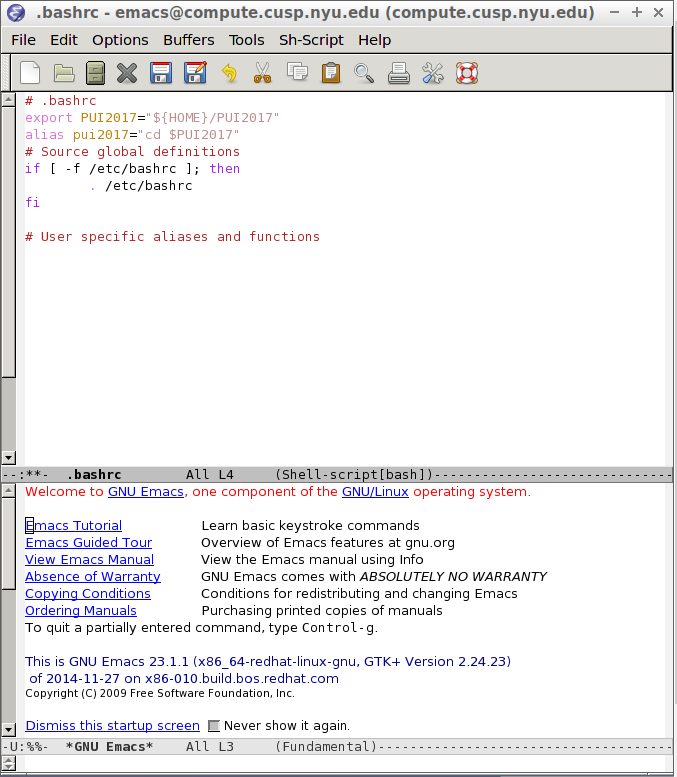
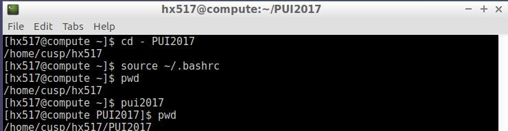

 PUI2017_hx517
 PUI2017_hx517
As the instruction, Setting up the environment:

1. create a directory on my workspace.

 use emac to create the directory PUI2017.

emac ~/.bashrc

create a directory on my workspace on CUSP compute called PUI2017.

2. echo $PUI2017
returns the full path to the directory. Save it in my .bashrc (linux) so that every time I open a new terminal, the terminal knows what the $PUI2017 env var is set to. create an alias such that typing

pui2017

3. add photo.

